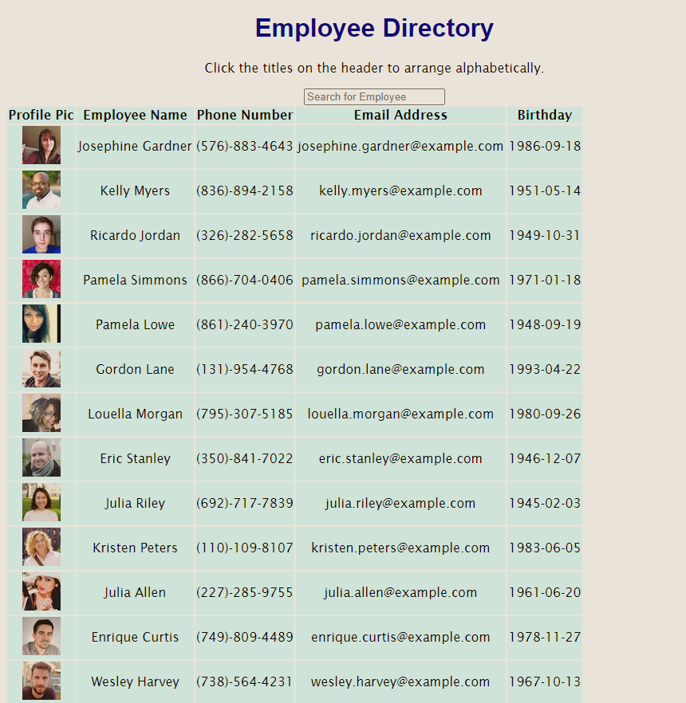

<h1 align="center">User React Directory</h1>

<p align="center">
  

  

  

  
</p>

<p align="center">
  <a href="#dart-about">About</a> &#xa0; | &#xa0; 
  <a href="#rocket-technologies">Technologies</a> &#xa0; | &#xa0;
  <a href="#checkered_flag-starting">Starting</a> &#xa0; | &#xa0;
  <a href="#memo-license">License</a> &#xa0; | &#xa0;
  <a href="https://github.com/daniarinker" target="_blank">Author</a>
</p>

<br>

## :dart: About

As A USER,
I WANT to be able to view my entire employee directory at once,
SO THAT I have quick access to their information.

An employee or manager would benefit greatly from being able to view non-sensitive data about other employees. It would be particularly helpful to be able to filter employees by name.

This project will render a random users generated page from the Random User API and will render a table of employees with corresponding information and a picture.

## :rocket: Technologies

The following tools were used in this project:

- [React](https://pt-br.reactjs.org/)

## :white_check_mark: Requirements

Before starting :checkered_flag:, you need to have [Git](https://git-scm.com) and [Node](https://nodejs.org/en/) installed.

## :checkered_flag: Starting

```bash
# Clone this project
$ git clone https://github.com/daniarinker/user-directory

# Access
$ cd user-react-directory

# Install dependencies
$ npm i

# Run the project
$ npm start

# The server will initialize in the <http://localhost:3000>
```

## :memo: License

This project is under license from MIT. For more details, see the [LICENSE](LICENSE.md) file.

Made with :heart: by <a href="https://github.com/daniarinker" target="_blank">Dania Rinker</a>

&#xa0;

<a href="#top">Back to top</a>
